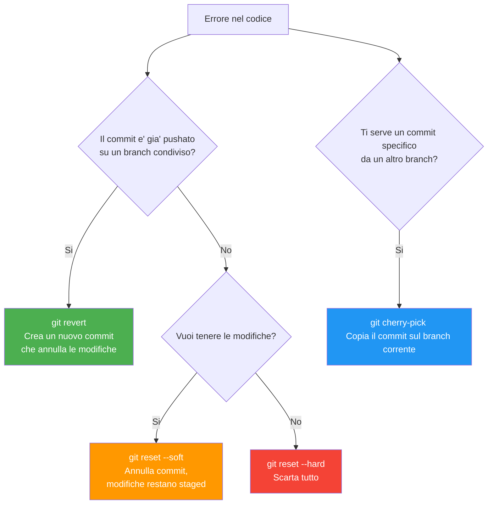

# Lezione 7 — Rollback e correzioni

**Obiettivo:** Imparare a tornare indietro quando qualcosa va storto

**Tempo stimato:** 20 minuti

---

## 7.1 Lo scenario: un errore nel codice

Leonardo ha mergiato la sua PR, ma si accorge che ha inserito un prezzo sbagliato nei piatti. Non esistono veri prezzi nel progetto, ma simuliamo che Leonardo abbia fatto un commit con contenuto errato su `src/piatti.md`.

Vogliamo "tornare indietro" — ma come?

La risposta dipende dalla situazione: il commit è già stato pushato? E' su un branch condiviso? Quanti commit dobbiamo annullare? Git offre diversi strumenti, e scegliere quello sbagliato può creare problemi a tutto il team.

---

## 7.2 I tre modi per tornare indietro

Git offre tre comandi principali per tornare indietro:

| Comando | Cosa fa | Sicuro? |
|---|---|---|
| `git revert` | Crea un **NUOVO commit** che annulla le modifiche | Si, non riscrive la storia |
| `git reset` | Sposta il puntatore HEAD all'indietro | **No**, riscrive la storia |
| `git cherry-pick` | Prende un commit specifico e lo applica | Si, aggiunge senza riscrivere |

### La regola d'oro

> **MAI usare `reset` su commit già pushati su un branch condiviso.**

Se il commit è su un branch dove anche altre persone lavorano (come `development` o `main`), resettare significherebbe riscrivere la storia. Il prossimo `git push` degli altri fallirebbe, è il repository diventerebbe un caos.

Per i branch condivisi: **usa sempre `revert`**.

Per i branch locali non ancora pushati: `reset` va benissimo.

---

## 7.3 git revert — il modo sicuro

Leonardo fa un commit "sbagliato". Parte dal branch `development`:

```bash
# Leonardo
cd ~/progetti/RistoranteAPI
git checkout development
git pull origin development
git worktree add ../RistoranteAPI-fix feature/04-fix-prezzi
cd ../RistoranteAPI-fix
```

Simula l'errore: modifica `src/piatti.md` cambiando il prezzo del Cannolo Siciliano:

In Antigravity: apri `src/piatti.md` e modifica il Cannolo Siciliano aggiungendo `- PREZZO ERRATO 500 EUR`. Il contenuto completo del file sarà:

```
# Catalogo Piatti

## Antipasti
* Bruschetta
* Caprese

## Primi
* Carbonara
* Amatriciana

## Secondi
* Cotoletta
* Pesce Spada

## Dolci
* Tiramisu'
* Panna Cotta
* Cannolo Siciliano - PREZZO ERRATO 500 EUR
```

Leonardo committa e pusha senza accorgersi dell'errore:

```bash
git add src/piatti.md
git commit -m "feat: aggiorna prezzi speciali"
git push -u origin feature/04-fix-prezzi
```

Crea la Pull Request:

```bash
gh pr create --base development --head feature/04-fix-prezzi \
  --title "feat: Aggiorna prezzi" --body "Aggiornamento prezzi piatti"
```

Simone approva senza notare l'errore:

```bash
# Simone
gh pr review 4 --approve --body "LGTM"
```

Leonardo mergia:

```bash
# Leonardo
gh pr merge 4 --merge
```

---

## 7.4 Oops! Ci accorgiamo dell'errore

Leonardo se ne accorge dopo il merge. Il commit è già su `development`, condiviso con Simone. Non possiamo usare `reset` perché riscriverebbe la storia.

Leonardo torna al repository principale e aggiorna:

```bash
# Leonardo
cd ~/progetti/RistoranteAPI
git checkout development
git pull origin development
```

Guarda la cronologia recente:

```bash
git log --oneline -5
```

Output:

```
a1b2c3d (HEAD -> development) Merge pull request #4 from LeonardoBianchi/feature/04-fix-prezzi
e3f4g5h feat: aggiorna prezzi speciali
c6d7e8f (tag: v0.2) feat: aggiunge ricette base
b9a0c1d feat: aggiunge piatti al catalogo
d2e3f4g Init: struttura progetto RistoranteAPI
```

Ora esegue il revert del merge commit:

```bash
git revert -m 1 HEAD
```

Il flag `-m 1` significa: "annulla il merge, mantenendo il primo parent (cioè lo stato di `development` prima del merge)". Git apre l'editor per il messaggio di commit — si può salvare con il messaggio predefinito:

```
Revert "Merge pull request #4 from LeonardoBianchi/feature/04-fix-prezzi"

This reverts commit a1b2c3d, reversing
changes made to e3f4g5h.
```

Pusha il revert:

```bash
git push origin development
```

Verifica la cronologia:

```bash
git log --oneline -5
```

Output:

```
f7g8h9i (HEAD -> development) Revert "Merge pull request #4 from LeonardoBianchi/feature/04-fix-prezzi"
a1b2c3d Merge pull request #4 from LeonardoBianchi/feature/04-fix-prezzi
e3f4g5h feat: aggiorna prezzi speciali
c6d7e8f (tag: v0.2) feat: aggiunge ricette base
b9a0c1d feat: aggiunge piatti al catalogo
```

Il file è tornato allo stato corretto, e la storia mostra sia l'errore sia la correzione. **La storia dice la verità: "abbiamo sbagliato e abbiamo corretto".**

---

## 7.5 git reset — per uso locale

`git reset` si usa solo su branch locali, non ancora pushati. Ha tre modalita':

```bash
# Demo: NON eseguire su branch condivisi!
git reset --soft HEAD~1
git reset --mixed HEAD~1
git reset --hard HEAD~1
```

| Modalita' | Cosa fa | Pericolo |
|---|---|---|
| `--soft` | Annulla il commit, le modifiche restano nella staging area | Basso — nulla si perde |
| `--mixed` | Annulla il commit + unstage, le modifiche restano nella working directory | Medio — devi riaddare i file |
| `--hard` | Annulla il commit + scarta TUTTE le modifiche | **Alto — le modifiche vengono perse** |

### Quando usarlo

Hai fatto un commit troppo presto e vuoi rifare:

```bash
# Commit fatto per sbaglio con troppi file
git reset --soft HEAD~1
git add src/piatti.md
git commit -m "feat: solo i piatti giusti"
```

Hai fatto un commit completamente sbagliato su un branch locale:

```bash
# Scarta tutto, torno allo stato del commit precedente
git reset --hard HEAD~1
```

**Ricorda**: `--hard` è irreversibile. Se non hai un backup delle modifiche, sono perse per sempre.

> **Nota Antigravity**: Antigravity non offre un pulsante per `git reset` (è un'operazione pericolosa). Usa il terminale integrato.

---

## 7.6 git cherry-pick — prendere un commit specifico

Scenario: Leonardo ha fatto due commit su un branch feature. Uno è utile, l'altro no. Vuole portare solo quello buono su `development`.

Leonardo crea il branch di esperimento:

```bash
# Leonardo
git checkout development
git pull origin development
git checkout -b feature/05-experiment
```

Aggiunge una nota utile a `src/piatti.md`:

In Antigravity: apri `src/piatti.md` e aggiungi alla fine del file la riga:

```
> Nota: tutti i prezzi sono IVA inclusa
```

```bash
git add src/piatti.md
git commit -m "docs: aggiunge nota IVA inclusa"
```

Poi fa un commit sbagliato su `src/menu.md`:

In Antigravity: apri `src/menu.md` e aggiungi alla fine del file la riga:

```
* PIATTO SBAGLIATO
```

```bash
git add src/menu.md
git commit -m "feat: piatto sbagliato che non vogliamo"
```

Leonardo vuole SOLO la nota IVA, non il piatto sbagliato. Guarda la cronologia:

```bash
git log --oneline -3
```

Output:

```
i8j9k0l feat: piatto sbagliato che non vogliamo
e5f6g7h docs: aggiunge nota IVA inclusa
f7g8h9i (development) Revert "Merge pull request #4..."
```

Nota l'hash del commit della nota IVA: `e5f6g7h`.

Torna su development e cherry-pick:

```bash
git checkout development
git cherry-pick e5f6g7h
git push origin development
```

Ora `development` ha la nota IVA inclusa ma NON il piatto sbagliato. E' come un copy-paste selettivo di un singolo commit.

---

## 7.7 Revert di una PR su GitHub

GitHub offre un pulsante **Revert** direttamente sull'interfaccia web.

### Via browser

1. Vai sulla PR mergiata
2. Clicca il pulsante **Revert** (compare dopo il merge)
3. GitHub crea automaticamente una nuova PR che annulla l'originale
4. Mergia la PR di revert come faresti normalmente

### Via CLI con gh

```bash
gh pr create --base development --head revert-branch \
  --title "Revert: feat: Aggiorna prezzi" \
  --body "Reverts SimoneRossi/RistoranteAPI#4"
```

Questo approccio è ideale perché mantiene il workflow delle PR: la correzione passa attraverso review e approvazione, proprio come qualsiasi altra modifica.

> **Nota GitLab:** Su GitLab, il revert di una MR mergiata funziona nello stesso modo: un pulsante "Revert" sulla MR chiusa. Via CLI: `glab mr revert <id>`. I comandi Git (`git revert`, `git reset`, `git cherry-pick`) sono identici su entrambe le piattaforme.

---

## 7.8 Cosa è successo — dietro le quinte

Ricapitoliamo i tre strumenti:



### I principi fondamentali

- `git revert` è il modo sicuro e collaborativo per annullare
- `git reset` è solo per lavoro locale non pushato
- `git cherry-pick` è come il copy-paste di un commit specifico
- Sui branch condivisi: **sempre revert, mai reset**
- La storia deve dire la verità': "abbiamo sbagliato e abbiamo corretto"
- Git è progettato per essere **append-only** — ogni azione viene registrata

---

## Riepilogo comandi

| Comando | Cosa fa |
|---|---|
| `git revert HEAD` | Crea un nuovo commit che annulla l'ultimo commit |
| `git revert -m 1 HEAD` | Annulla un merge commit mantenendo il primo parent |
| `git reset --soft HEAD~1` | Annulla l'ultimo commit, modifiche restano staged |
| `git reset --mixed HEAD~1` | Annulla l'ultimo commit, modifiche restano nella working directory |
| `git reset --hard HEAD~1` | Annulla l'ultimo commit, scarta tutte le modifiche |
| `git cherry-pick <hash>` | Applica un commit specifico sul branch corrente |
| `git log --oneline -5` | Mostra gli ultimi 5 commit in formato compatto |
| `gh pr review <N> --approve` | Approva una PR da riga di comando (alternativa: GitHub Web UI) |
| `gh pr merge <N> --merge` | Mergia una PR da riga di comando (alternativa: GitHub Web UI) |
| `gh pr create --base <branch> --head <branch>` | Crea una PR specificando base e head (alternativa: GitHub Web UI) |

---

*Prossima lezione: Risoluzione dei conflitti di merge.*
